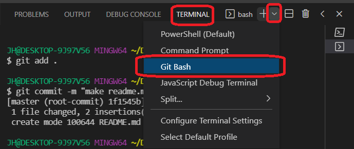

## Git

---

Git이 뭘까?

* 분산 버전 관리 시스템

|      | 중앙 집중 |  분산형  |
| :--: | :-------: | :------: |
|  Ex  |   은행    | 블록체인 |

**Git**

* 로컬에서 관리되는 버전 관리 시스템(VCS : Version Control System)
* 소스코드 수정에 따른 버전을 관리해주는 시스템
* 분산 버전 관리 시스템

**GitHub**

* 클라우드 방식으로 관리되는 버전 관리 시스템(VCS)

* 자체 구축이 아닌 빌려쓰는 클라우드 개념

* 오픈소스는 일정 부분 무료로 저장 가능, 아닐 경우 유료

* Git  기반의 저장소 서비스

  

## Git 설치

---

* [Git Download ](https://git-scm.com/)

* `git download` 클릭

* `Git-2.33.0.2-64-bit.exe`(설치된 파일 실행) -> `git bash here` 무조건 체크

  

## Git bash

---

* Git 사용에 특화된 명령어 실행기

* UNIX / Linux 명령어 사용 가능! 

  

## Unix/Linux 명령어 (CLI - Command_Line Interface)

---

* `ls` : 현재위치의 파일 목록보기

* `cd <path>` : 현재 위치 이동하기

* `cd ..` : 상위 폴더로 이동하기

* `~` : `Home 디렉토리`를 의미

* `mkdir <name>` : 폴더 생성하기

* `touch <name>` : 파일 생성하기

* `rm <name>` : 파일 삭제하기

* `rm -r <name>` : 폴더 삭제하기

* `.` : 현재 디렉토리

  

## VSCode

---

* Terminal -> new Terminal (단축키 Ctrl + Shift  + `)
* Terminal 우측 +옆 아래방향 클릭 Git bash 선택

* `git --version`git의 버전이 잘 나온다면 git 설치가 잘 되었다는 의미.

  

## Commit

---

**"Commit"** 한다. 특정 버전을 남긴다. 변경사항

**commit의 세가지 영역**

| Working Directory                    |                   | Staging Area                                                 |                  | Repository                        |
| :----------------------------------- | :---------------- | :----------------------------------------------------------- | ---------------- | --------------------------------- |
| 내가 작업하는 **실제 디렉토리** | => `git add` | **커밋**으로 남기고 싶은,  **특정 버전**으로남기고 싶은  파일이 있는 곳 | => `commit` | **커밋**들이 저장되는 저장소 |

## Git 명령어

---

* `git status` : 현재 git의 상태 확인.

* `git init` : 로컬 저장소 생성, .git 디렉토리에 버전관리에 필요한 모든것이 들어있음.

* `git add .` :  추적 되지 않은 모든 파일과 추적 하고 있는 파일 중 수정 된 파일을 모두 

​					            Staging Area에 올림.

* `git commit -m` : -m 커밋 메시지를 남김
  * error : "please tell me who you are."
  * `git_config --global user.email "내 이메일"`
  * `git_config --global user.name "내 아이디"`
  * [에러 해결 방법](https://tube-life.tistory.com/28)
  
* `git diff commit_id commit_id` : 커밋간의 차이를 보여주는 명령어(하나의 repository에서는 앞에 네자리면 적어줘도 확인 가능)

* `git remote add origin (git repository 주소)` : remote repository와 local repository 연결

* `git push -u origin master` :  local내용을 remote로 전송, -u는 처음에 한번만 써주면 됨. 

* `git clone (git repository 주소)` : remote repository의 내용을 local repository로 가져옴(디렉토리까지 가져옴).
  `git clone (git repository 주소) .` : 디렉토리 없이 내용물만 가져옴.

* `git remote rm origin` : 연결했던 remote repository와의 연결을 끊어줌.

* `git push origin master`: **origin 로컬**에 있는 **master** 변경사항을 푸쉬

* `git pull origin master`: **remote origin master**에 있는 변경사항을 풀

* `git restore --staged {file_name} `: **git add** 취소하기!

* `git restore {file_name}`: 최신파일로 돌아감(**작업했던 내용이 날아감!**)

* `git reset` : 옵션이 다양함 잘 알고 사용해야함.

  ​	--hard {commit_id} : commit_id 시점으로 돌아감

  ​	--soft : ~~공부해서 추가하자!~~

  ​	--mixed : ~~공부해서 추가하자!~~

* `touch .gitignore` : 원하지 않는 파일을 제외시킬수 있음(git add . 에서 제외)

  ​	`*.txt` : 모든 .txt 파일은 ignore하겠다.

  ​	`*.png` : 모든 .png 파일은 ignore하겠다.

  ​	`!test01.txt` : `*.txt`를 한상태일 때 test.txt 파일은 ignore 하지 않겠다. 

  ​	`img02.png` : 파일 이름을 적어 ignore한다.

  ​	`data/` : data 디렉토리아래있는 것들은 ignore 하겠다.
  
  ​	**[GoTOGitIgnore(gitignore을 도와주는 사이트)](https://www.toptal.com/developers/gitignore)**

## Shared Repository

---

* **Shared Repository model**은 **동일한 저장소를 공유**하여 활용하는 방식.
  * **팀장(Manager)** : **repository owner (project manager)**
  * **팀원(Crew)** : **collaborator (a.k.a no-yeah-contributor)**
* Invite collaborator (팀장 => 팀원초대)
  * collaborator에 등록 되어야 해당 저장소에 대한 **push 권한**이 부여됨.
* Accept Invitation (팀원이 이메일을 통해 초대 수락)

|                    Manager                    |                             Crew                             |
| :-------------------------------------------: | :----------------------------------------------------------: |
|            GitHub Repository 생성             |           GitHub 가입한 메일로 오는 초대 메일 수락           |
|           Local에서 Repository 생성           | git clone URL_git (.붙이면 해당 지점에  폴더생성 없이 클론 생성) |
|                  `git init`                   |                          작업 수행                           |
|        `git remote add origin URL_git`        |                     `git add` & `commit`                     |
|                   작업 수행                   |                   `git push origin master`                   |
|             `git add` & `commit`              |                                                              |
| `git push -u origin manager` (-u 최초 수행시) |                                                              |
|    Manage access => invite a collaborator     |                                                              |

## Branch & 명령어

---

* 특정 커밋을 가리키는 **'포인터'**

* **명령어**

  * `git branch` : 브랜치 목록보기
  * `git brach {branch name}` : 브랜치 생성
  * `git checkout {branch name}` : 브랜치 이동
  * `git checkout -b {branch name}` : 브랜치 생성 및 이동
  * `git brach -d {branch name}` : 브랜치 삭제
  * `git merge {branch name}` : 브랜치 병합

* **Brach merge** : 각 브랜치에서 작업을 한 이후 이력을 합치기 위해 일반적으로 merge 명령어를 사용. 만약 **서로 다른 commit**에서 **동일한 파일을 수정**한 경우 **충돌**이 발생. 이 경우 반드시 직접 수정을 진행 해야한다. 

* **Brancg nerge -fast-forward** : 기존 master 브랜치에 변경사항이 없어 단순히 앞으로 이동

* **Branch merge (merge commit case)** : 기존 master 브랜치에 변경사항이 있어 병합 커밋 발생

  

## Pull Request

---

* **Pull Request**는 내가 수정한 코드가 있으니 branch를 검토 후 병합해달라고 요청하는 과정

  코드 충돌을 최소화 할 수 있고 push 권한이 없는 오픈소스 프로젝트에 기여할 때 많이 사용.

* **과정**

  1. 내가 수정하고자 하는 코드가 있는 Repository에 들어가 * Fork 버튼을 클릭한다.
  2. clone을 만들고 remote 설정을 한다.
  3. branch를 생성한다.
  4. branch에서 작업을 하고 add, commit, push 한다.
  5. Pull Request를 생성한다.
  6. 해당 Repository Manager가 Merge를 하면 동기화를 하고 branch를 삭제한다.
  7. Merge해주지 않는다면 거절을 당한 것!

> *Fork : 다람 사람의 remote repository를 나의 remote repository로 복사하는 것!

## Git Flow

---

* Git을 활용하여 협업하는 흐름으로 branch를 활용하는 전략을 의미!
* 주요 특징

|            branch            | 주요 기능                                                    | 예시                                                        |
| :--------------------------: | :----------------------------------------------------------- | :---------------------------------------------------------- |
|         Master(main)         | 배포 가능한 상태의 코드                                      | LOL 클라이언트 라이브 버전 (9.23.298.3143)                  |
|       Developer(main)        | - feature branch로 나뉘어지거나,    발생된 버그 수정 등 개발 진행 - 개발 이후 release branch로 갈라짐. | 다음 패치를 위한 개발 (9.24)                                |
| feature branches(supporting) | - 기능별 개발 브랜치(topic branch) - 기능이 반영되거나 드랍되는 경우 브랜치 삭제 | 개발시 기능별 예) 신규 챔피언 세나, 드래곤 업데이트    |
| release branches(supporting) | - 개발 완료 이후 QA/Test등을 통해 얻어진 다음   배포 전 minor bug fix등 반영 | 9.24a, 9.24b, ...                                           |
|     Hotfixes(suppoting)      | - 긴급하게 반영 해야하는 bug fix - release branch는 다음 버전을 위한 것이라면, hotfix는 현재 버전을 위한 것 | 기급 패치를 위한 작업 예) 버그로 인한 챔피언 선택 금지 |

* **기본 원칙**

  1. master branch는 반드시 배포 가능한 상태여야 한다.

  2. featur branch는 각 기능의 의도를 알 수 있도록 작성한다.

  3. commit message는 매우 중요하며, 명확하게 작성한다.

  4. Pull Request를 통해 협업을 진행한다.

  5. 변경사항을 반영하고 싶다면, master branch에 병합한다.

     

## Git은 왜 Staging Area를 거쳐서 커밋을 해야하는가?

---

* 여러개의 파일중 원하는 파일만 커밋하기위해 Staging Area를 거쳐야함.

> Staging Area (커밋으로 **남기고 싶은**, 특정버전으로 **관리하고 싶은** 파일만 두는 곳)

## HEAD가 무엇인지 찾아보기

